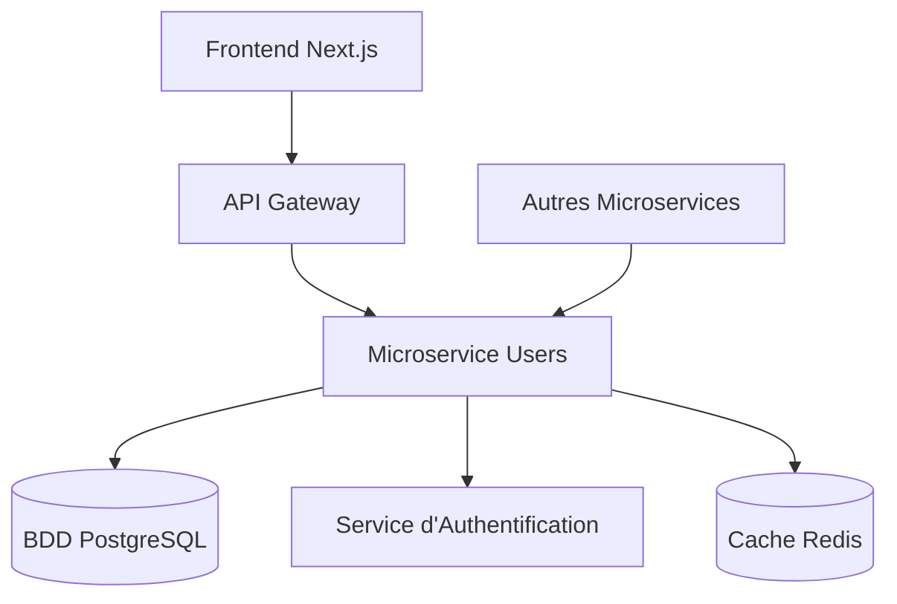
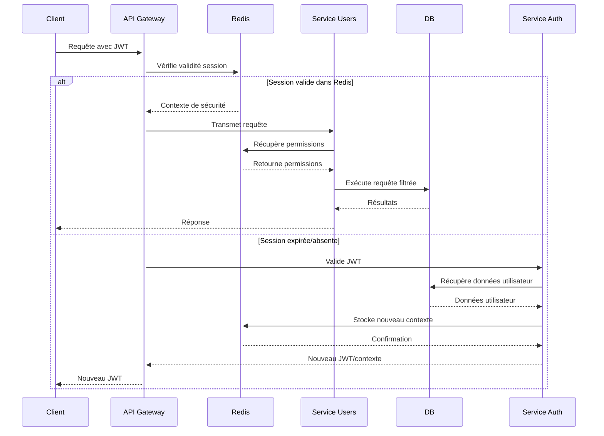
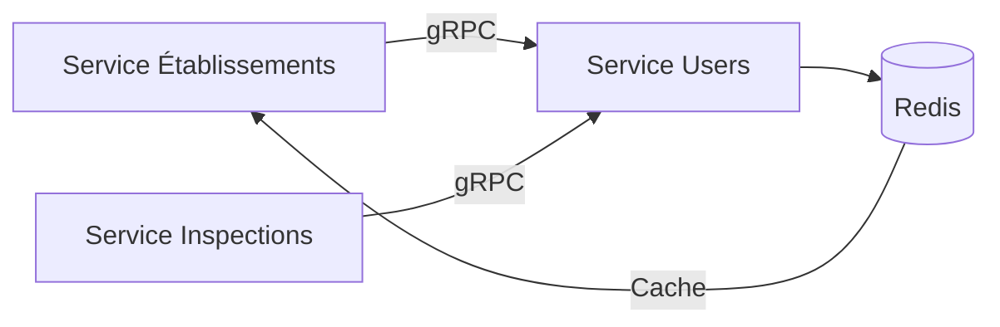

# Introduction au Projet NYOTA.md

## Projet NYOTA - Écosystème Intégré de Gestion et de Pilotage pour le Ministère de l'Éducation

### 1. Contexte du Projet

Le projet NYOTA vise à développer un écosystème numérique intégré pour le Ministère de l'Éducation. Il se compose de deux plateformes interdépendantes :

1.  **NYOTA-Ministère :** Une application modulaire de gestion (ERP) et de support à la décision (DSS) conçue pour les opérations administratives et stratégiques du ministère.
2.  **NYOTA-École :** Une plateforme de gestion scolaire (School Management System) destinée aux établissements de tous niveaux (primaire, secondaire, supérieur). Elle sert à la fois d'outil de gestion local et de canal principal pour la collecte de données de performance standardisées.

L'objectif est de créer une plateforme unifiée et sécurisée qui non seulement optimise les processus du ministère, mais qui établit également un flux de données fiable depuis la source (les écoles) pour un pilotage stratégique national basé sur des preuves.

### 2. Objectifs Principaux

#### Vision

Devenir l'écosystème de référence pour la gestion administrative et le pilotage stratégique de l'éducation, en connectant tous les acteurs (ministère, rectorats, écoles) sur une plateforme de données unifiée.

#### Objectifs Stratégiques

*   **Modernisation :** Développer une solution ERP modulaire adaptée aux contraintes des administrations publiques, avec un accent sur la sécurité, la traçabilité et la conformité.
*   **Support à la Décision (DSS) :** Fournir des analyses de données fiables et des tableaux de bord interactifs pour supporter la prise de décision et la planification stratégique du ministère.
*   **Connectivité :** Offrir aux établissements scolaires un outil de gestion moderne, tout en automatisant la collecte de données agrégées pour l'analyse au niveau national.

### 3. Architecture Technique

#### Stack Technologique

*   **Frontend :** Next.js 14 avec TypeScript et ShadCN
*   **Backend :** Nest.Js avec TypeScript
*   **Base de Données Transactionnelle :** PostgreSQL 15+
*   **Cache :** Redis
*   **Infrastructure :** Docker + Kubernetes
*   **Architecture :** Mulirepo pour la securite et la granularite

#### Architecture Applicative

*   **NYOTA-Ministère :** L'application centrale (ERP/DSS) utilisée par le personnel du ministère.
*   **NYOTA-École :** Une application web **multi-tenant**, où chaque école dispose d'un environnement sécurisé et isolé. Elle expose une API REST/GraphQL sécurisée pour synchroniser les données agrégées avec la plateforme centrale.

#### Architecture de Support à la Décision (DSS)

Pour fournir des capacités d'analyse sans impacter les performances opérationnelles, une architecture dédiée est mise en place.

*   **Entrepôt de Données (Data Warehouse) :** Un entrepôt de données central (ex: PostgreSQL optimisé pour l'analytique, ou une base de données en colonnes comme ClickHouse) est utilisé pour consolider les données.
*   **Pipelines de Données (ETL/ELT) :**
    1.  **Pipeline Opérationnel :** Un processus ETL extrait, transforme et charge les données de la base transactionnelle de `NYOTA-Ministère` dans l'entrepôt de données.
    2.  **Pipeline Scolaire :** Un second processus ETL collecte les données de performance agrégées et anonymisées depuis les instances de `NYOTA-École` via une API Gateway.
*   **Outils de BI et Visualisation :** Des plateformes open-source comme **Apache Superset** ou **Metabase** sont intégrées pour permettre l'exploration des données, la création de rapports personnalisés et la visualisation sur des tableaux de bord interactifs.

### 4. Modèle de Sécurité à 4 Couches

Le cœur de la sécurité de l'écosystème NYOTA repose sur un modèle à 4 couches, appliqué à la fois à `NYOTA-Ministère` et `NYOTA-École`.

*   **Couche 1 : Authentification :** Gestion des utilisateurs avec hiérarchie, authentification multi-facteurs (MFA) et gestion des sessions sécurisées.
*   **Couche 2 : Contrôle d'Accès par Groupes (ACL) :** Permissions CRUD granulaires basées sur des rôles fonctionnels.
*   **Couche 3 : Règles de Visibilité (Row-Level Security) :** Filtrage automatique des données selon la hiérarchie et le périmètre de l'utilisateur (ex: un directeur régional ne voit que les données de sa région).
*   **Couche 4 : Contrôle d'Affichage :** Masquage conditionnel des champs sensibles et personnalisation de l'interface selon les permissions.

### 5. Modules Prévus

#### Modules NYOTA-Ministère

*   **Modules Core (Phase 1) :** Authentification & Autorisation, Configuration, Moteur de Workflow, Gestion Documentaire, Audit & Logging, Reporting.
*   **Module d'Analyse & DSS :** Tableaux de bord visualisant les indicateurs de performance clés (KPIs) nationaux, régionaux et par établissement. Permet des analyses croisées (ex: budget vs. performance).
*   **Modules Métier (Phases suivantes) :** Gestion des Dossiers, Ressources Humaines, Finances & Comptabilité, Marchés Publics, Conformité.

#### Modules NYOTA-École

*   **Gestion des Élèves :** Inscriptions, dossiers académiques, informations personnelles.
*   **Gestion Pédagogique :** Suivi des notes, gestion des bulletins, emplois du temps.
*   **Vie Scolaire :** Gestion des présences et des absences.
*   **Communication :** Portail pour les parents, élèves et enseignants.
*   **Module de Synchronisation :** Composant technique chargé d'envoyer périodiquement les indicateurs de performance (agrégés et anonymisés) de manière sécurisée à la plateforme centrale.

### 6. Défis Techniques à Résoudre

*   **Sécurité & Confidentialité :** Implémentation du Row-Level Security au niveau applicatif et anonymisation rigoureuse des données personnelles lors de la synchronisation.
*   **Architecture Multi-Tenant :** Conception de `NYOTA-École` pour garantir une isolation stricte et sécurisée des données entre les établissements.
*   **Synchronisation des Données :** Développement d'un protocole d'API robuste, sécurisé et versionné pour collecter les données de milliers d'écoles.
*   **Performance Analytique :** Optimisation des requêtes sur de grands volumes de données dans l'entrepôt de données.
*   **Scalabilité :** L'infrastructure doit être capable de supporter un grand nombre d'établissements connectés simultanément.

### 7. Valeur Ajoutée

*   **Pour l'Administration :** Efficacité, transparence, sécurité et une capacité de pilotage stratégique basée sur des données fiables et à jour.
*   **Pour les Écoles :** Accès à un outil de gestion moderne qui simplifie leurs opérations quotidiennes.
*   **Innovation Technique :** Architecture modulaire et évolutive, modèle de sécurité adapté au secteur public, et intégration native des flux de données entre les niveaux administratifs et opérationnels.


# Modules du Projet NYOTA.md

### **Résumé de l'Architecture Modulaire du Projet NYOTA**

Ce document synthétise la structure du projet NYOTA, divisée en deux ensembles de modules distincts : ceux destinés à l'usage des établissements scolaires et ceux destinés à l'administration centrale du ministère.

### **1. Modules pour les Établissements Scolaires (12 Modules)**

Ces modules constituent le système de gestion scolaire (SGS) utilisé au quotidien par les écoles pour gérer leurs opérations.

|                                       |                                                              |
| ------------------------------------- | ------------------------------------------------------------ |
| **Module**                            | **Mission Principale**                                       |
| **Gestion des inscriptions**          | Gérer l'ensemble du processus d'admission et d'inscription des élèves, de la candidature à l'enregistrement final. |
| **Vie scolaire**                      | Assurer le suivi quotidien des élèves, incluant la gestion des présences, des absences, des retards, et des incidents disciplinaires. |
| **Finance et comptabilité**           | Gérer les frais de scolarité, la facturation, les paiements, et la comptabilité générale de l'établissement. |
| **Ressources humaines et paie**       | Administrer le personnel de l'école, incluant les contrats, les profils, la gestion des congés et le traitement de la paie. |
| **Cantine**                           | Gérer les inscriptions au service de cantine, la planification des repas et le suivi des paiements associés. |
| **Outil de collaboration**            | Faciliter la communication interne entre l'administration, les enseignants, les élèves et les parents via une messagerie sécurisée. |
| **Bibliothèque et matériel**          | Gérer le catalogue de la bibliothèque, les prêts de livres et le suivi de l'inventaire du matériel pédagogique. |
| **Gestion des cours et classes**      | Organiser les emplois du temps, la création des classes, l'assignation des enseignants et la gestion des matières enseignées. |
| **Gestion des résultats académiques** | Saisir les notes, calculer les moyennes, générer les bulletins et suivre la progression académique de chaque élève. |
| **Examen et concours**                | Organiser les examens internes, les concours et gérer les inscriptions ainsi que la publication des résultats. |
| **Association**                       | Coordonner les activités extrascolaires, les événements, les clubs et la communication avec les associations de parents d'élèves. |
| **Gestion des utilisateurs**          | Administrer les comptes et les droits d'accès au système pour les différents profils d'utilisateurs au sein de l'école. |

### **2. Modules pour les Ministères (8 Modules)**

Ces modules forment la plateforme centrale utilisée par l'administration pour la supervision, la régulation et la planification du système éducatif national.

|                                                   |                                                              |
| ------------------------------------------------- | ------------------------------------------------------------ |
| **Module**                                        | **Mission Principale**                                       |
| **Gestion des établissements scolaires**          | Servir de registre national officiel pour le cycle de vie de chaque établissement (création, autorisation, modification, fermeture). |
| **Statistiques, reporting et aide à la décision** | Agréger, analyser et visualiser les données de tout le système pour produire des rapports, des statistiques et des tableaux de bord pour la planification stratégique. |
| **Gestion des cours et programmes**               | Définir et gérer le curriculum national, les programmes académiques officiels et les filières d'enseignement autorisées. |
| **Gestion administrative centrale**               | Gérer les processus administratifs internes au ministère qui ne sont pas couverts par d'autres modules (ex: courrier, archives centrales). |
| **Gestion des transferts scolaires**              | Superviser et valider les transferts d'élèves entre les établissements au niveau national. |
| **Module de communication et collaboration**      | Diffuser les communications officielles (circulaires, notes de service) à l'ensemble des établissements ou à des groupes ciblés. |
| **Gestion du patrimoine et de l'équipement**      | Gérer l'inventaire des biens immobiliers (terrains, bâtiments) et des équipements majeurs appartenant au ministère. |
| **Gestion des inspections générales**             | Planifier, suivre et archiver les rapports des missions d'inspection dans les établissements scolaires. |


# Résumé de la Stratégie Technique du Projet NYOTA

Ce document synthétise les décisions architecturales et la stratégie d'implémentation pour l'écosystème NYOTA, basées sur l'analyse des documents de spécification.

## 1. Vision d'Ensemble : Les Deux Piliers du Projet

Le projet repose sur la synergie de deux documents clés :

1.  **`Modules du Projet NYOTA.md` (Le "QUOI")**
    *   **Rôle :** C'est le **catalogue fonctionnel** complet du projet. Il liste tous les modules et fonctionnalités attendus.
    *   **Utilité :** Il sert de feuille de route pour le développement et définit le périmètre de ce qui doit être construit.

2.  **`Introduction au Projet NYOTA.md` (Le "COMMENT")**
    *   **Rôle :** C'est le **plan directeur technique**. Il définit les technologies, les standards, les modèles (sécurité, données) et les principes architecturaux.
    *   **Utilité :** Il garantit que tous les modules seront construits de manière cohérente, sécurisée, et scalable, assurant que toutes les pièces s'assembleront correctement.

Ensemble, ces deux documents fournissent un plan d'action complet, liant les exigences fonctionnelles aux contraintes techniques.

## 2. Validation de l'Architecture Microservices

L'approche basée sur les **microservices** est confirmée comme étant la stratégie la plus adaptée au projet NYOTA. Cette décision est directement soutenue par les objectifs définis dans le plan directeur technique :

*   **Séparation des Domaines :** La distinction claire entre `NYOTA-Ministère` et `NYOTA-École`, ainsi que la décomposition en modules fonctionnels, se prête naturellement à une architecture de services indépendants.
*   **Communication par API :** Le principe d'une communication via API REST/GraphQL entre les systèmes est le standard de facto pour les microservices.
*   **Déploiement Indépendant :** L'utilisation de **Docker et Kubernetes** est explicitement mentionnée, ce qui est l'un des avantages majeurs des microservices, permettant des mises à jour et une maintenance sans interruption globale.
*   **Scalabilité Ciblée :** L'architecture permettra de faire évoluer les ressources de manière indépendante pour chaque service en fonction de sa charge.

## 3. Stratégie d'Implémentation Pragmatic

Je comprends parfaitement votre situation ! Management veut une granularité maximale... C'est effectivement une approche qui peut être douloureuse mais nous allons l'organiser de manière intelligente.

## Stratégie "Un Module = Un Repository" pour NYOTA

### Architecture Résultante

Nous aurons **23 repositories principaux** + repositories de support :

**NYOTA-École (12 repos) :**

- `nyota-inscriptions`
- `nyota-vie-scolaire` 
- `nyota-finance`
- `nyota-hr-compta`
- `nyota-cafeteria`
- `nyota-collaboration`
- `nyota-librairie`
- `nyota-cours-classes`
- `nyota-resultats-academique`
- `nyota-examens-concours`
- `nyota-associations`
- `nyota-gestion-utilisateurs`

**NYOTA-Ministère (8 repos) :**

- `nyota-gestion-establissements`
- `nyota-statistiques-rapports`
- `nyota-curriculum-programme`
- `nyota-administration-centrale`
- `nyota-transfers-scolaire`
- `nyota-communication`
- `nyota-patrimoine-equippement`
- `nyota-inspections`

**Repositories de Support (7 repos) :**

- `nyota-noyau-central`
- `nyota-auth-gateway`
- `nyota-data-pipeline`
- `nyota-infrastructure`
- `nyota-cli-tools`
- `nyota-api-gateway`
- `nyota-documentation`


# Gestion des accès et permissions

## 1. Contexte et Approche

Après une analyse approfondie des exigences de sécurité complexes de notre projet, nous proposons l'adoption d'un modèle de sécurité multi-couches sur mesure pour NYOTA. Cette approche, inspirée des architectures les plus robustes de l'industrie (telles que celles utilisées dans les plateformes ERP modernes comme Odoo et d'autres tel que Active Directory), garantit une protection des données à la fois granulaire, flexible et évolutive.

Le principe fondamental est que la sécurité est définie à plusieurs niveaux. Pour qu'un utilisateur puisse accéder à une information, sa requête doit passer avec succès au travers de chaque couche de contrôle.

## 2. Les Quatre Couches du Modèle de Sécurité NYOTA

Le Modèle proposé s'articule autour de quatre couches de contrôle superposées :

1. **Couche 1 : Authentification et Gestion des Utilisateurs** - Qui a le droit d'entrer dans le système ?
2. **Couche 2 : Contrôle d'Accès par Groupes (ACLs)** - Quels types d'information un utilisateur a-t-il le droit de manipuler ?
3. **Couche 3 : Règles de Visibilité des Données (Row-Level Security)** - Quelles données spécifiques un utilisateur a-t-il le droit de voir ?
4. **Couche 4 : Contrôle d'Affichage (Vues et Champs)** - Quels éléments de l'interface sont visibles pour un utilisateur ?

## Détail des Couches de Contrôle

### Couche 1 : Authentification et Gestion des Utilisateurs

C'est la porte d'entrée du système. Elle repose sur la table `core.users`.

- **Identité** : Chaque utilisateur est unique et doit posséder un compte actif pour se connecter.
- **Hiérarchie** : La structure organisationnelle est directement modélisée dans cette table via le champ `manager_id`, créant une chaîne de commandement claire et exploitable par les autres couches de sécurité.

### Couche 2 : Contrôle d'Accès par Groupes (ACLs)

Cette couche définit les permissions générales basées sur la fonction de l'utilisateur.

- **Groupes de Sécurité** : Remplacent la notion de "rôles". Un groupe représente une fonction ou un ensemble de responsabilités (ex: Groupe des Agents Instructeurs, Groupe des Inspecteurs). Un utilisateur peut appartenir à plusieurs groupes.
- **Droits d'Accès** : Pour chaque objet métier principal de l'application (ex: l'objet Dossier Établissement), nous définissons les droits fondamentaux pour chaque groupe :
  - Lecture
  - Écriture / Modification
  - Création
  - Suppression
- **Exemple** : Pour l'objet Dossier Etablissement :
  - Le Groupe des Agents Instructeurs aura les droits de Lecture, Écriture et Création.
  - Le Groupe des Auditeurs n'aura que le droit de Lecture.

### Couche 3 : Règles de Visibilité des Données (Row-Level Security)

C'est la couche la plus sophistiquée, qui assure la confidentialité et le respect de la hiérarchie. Elle filtre les enregistrements (les lignes de la base de données) auxquels un utilisateur peut accéder.

- **Concept** : Une "Règle de Visibilité" est une condition de filtrage qui s'ajoute automatiquement à toute tentative de lecture ou d'écriture de données. Ces règles sont associées à un groupe de sécurité.
- **Exemple 1** : Application de la Hiérarchie
  - Pour le Groupe des Chefs d'Équipe, on applique une règle de visibilité sur les dossiers qui se traduit par : "Ne montrer à l'utilisateur que les dossiers qui lui sont assignés OU qui sont assignés à une personne dont il est le manager direct."
- **Exemple 2** : Application du Partitionnement Géographique
  - Pour le Groupe des Inspecteurs Régionaux, on applique une règle qui se traduit par : "Ne montrer que les dossiers dont la région correspond à la région de l'utilisateur connecté."

### Couche 4 : Contrôle d'Affichage (Vues et Champs)

Cette dernière couche ajuste l'interface utilisateur pour ne présenter que les informations et les actions pertinentes.

- **Concept** : Il est possible de masquer des champs spécifiques, des boutons ou même des sections entières d'un écran en fonction des groupes de sécurité de l'utilisateur.
- **Exemple** : Le champ "Salaire" dans la fiche d'un employé ne sera visible que pour les utilisateurs du Groupe des Gestionnaires RH. Le bouton "Valider l'Agrément Définitif" sur un dossier ne sera visible que pour le Groupe des Directeurs.

## Conclusion : Un Modèle Robuste et Personnalisé

En adoptant ce modèle à quatre couches, le projet NYOTA se dote d'une architecture de sécurité qui est :

- **Complète** : Elle couvre tous les aspects, de l'authentification à l'affichage final.
- **Centralisée** : Les règles de sécurité sont gérées de manière cohérente et ne sont pas dispersées dans le code applicatif.
- **Flexible** : Les changements organisationnels (promotions, restructurations) sont gérés par de simples mises à jour de données (changement de groupe ou de `manager_id`), sans nécessiter de modification du code source.

Cette approche constitue une base solide et professionnelle pour garantir l'intégrité, la confidentialité et la traçabilité des données au sein de l'application gouvernementale NYOTA.


# Model de base de Donnees pour le projet NYOTA

erDiagram

    %% ========================================
    %% A. ENTITÉS CENTRALES ET MULTI-TENANT (REFACTORISÉES)
    %% ========================================
    
    UTILISATEURS {
        uuid id PK "Identifiant unique"
        varchar email UK "Adresse email unique (sert de login)"
        varchar mot_de_passe_hash "Hash du mot de passe"
        varchar prenom "Prénom"
        varchar nom "Nom de famille"
        varchar type_utilisateur "Type: MINISTRY_STAFF, SCHOOL_ADMIN, TEACHER"
        uuid etablissement_id FK "FK vers ETABLISSEMENTS (NULL si utilisateur du ministère)"
        uuid manager_id FK "Référence au manager (pour le personnel du ministère)"
        boolean est_actif "Compte actif"
        timestamp derniere_connexion "Dernière connexion"
        timestamp cree_le "Date de création"
        timestamp modifie_le "Date de modification"
    }
    
    ETABLISSEMENTS {
        uuid id PK "Identifiant unique de l'établissement (Tenant)"
        varchar nom "Nom de l'établissement"
        varchar code_etablissement UK "Code unique de l'établissement"
        varchar type_etablissement "Type: Primaire, Secondaire, Supérieur"
        varchar secteur "Secteur: PUBLIC, PRIVE_SOUS_CONTRAT, PRIVE_HORS_CONTRAT"
        varchar statut_administratif "Statut: EN_ATTENTE, AUTORISE, SUSPENDU, FERME"
        text adresse_complete "Adresse postale complète"
        decimal latitude "Coordonnée latitude"
        decimal longitude "Coordonnée longitude"
        uuid region_id FK "FK vers REGIONS"
        uuid departement_id FK "FK vers DEPARTEMENTS_GEOGRAPHIQUES"
        uuid commune_id FK "FK vers COMMUNES"
        varchar numero_telephone "Numéro de téléphone"
        varchar email_officiel "Email officiel de l'établissement"
        varchar site_web "Site web de l'établissement"
        integer effectif_total_eleves "Effectif total d'élèves"
        integer effectif_total_personnel "Effectif total du personnel"
        date date_ouverture "Date d'ouverture officielle"
        date date_fermeture "Date de fermeture (si applicable)"
        boolean est_actif "Établissement actif"
        timestamp cree_le "Date de création du dossier"
        timestamp modifie_le "Date de dernière modification"
        uuid cree_par FK "Utilisateur qui a créé le dossier"
        uuid modifie_par FK "Utilisateur qui a modifié en dernier"
    }
    
    %% ========================================
    %% B. STRUCTURES GÉOGRAPHIQUES ET ADMINISTRATIVES
    %% ========================================
    
    REGIONS {
        uuid id PK "Identifiant unique"
        varchar nom "Nom de la région administrative"
        varchar code UK "Code unique de la région"
        boolean est_actif "Région active"
    }
    
    DEPARTEMENTS_GEOGRAPHIQUES {
        uuid id PK "Identifiant unique"
        varchar nom "Nom du département géographique"
        varchar code UK "Code unique du département"
        uuid region_id FK "FK vers REGIONS"
        boolean est_actif "Département actif"
    }
    
    COMMUNES {
        uuid id PK "Identifiant unique"
        varchar nom "Nom de la commune"
        varchar code_postal "Code postal"
        uuid departement_id FK "FK vers DEPARTEMENTS_GEOGRAPHIQUES"
        boolean est_actif "Commune active"
    }
    
    DEPARTEMENTS_MINISTERIELS {
        uuid id PK "Identifiant unique"
        varchar nom "Nom du département ministériel"
        varchar code UK "Code unique du département"
        uuid departement_parent_id FK "Département parent (hiérarchie)"
        boolean est_actif "Département actif"
    }
    
    %% ========================================
    %% C. GESTION DES DEMANDES ET WORKFLOWS
    %% ========================================
    
    DEMANDES_ETABLISSEMENT {
        uuid id PK "Identifiant unique"
        varchar type_demande "Type: CREATION, MODIFICATION, FERMETURE, SUSPENSION"
        varchar statut_demande "Statut: SOUMISE, EN_COURS, APPROUVEE, REJETEE"
        uuid etablissement_id FK "FK vers ETABLISSEMENTS (NULL pour création)"
        uuid demandeur_id FK "FK vers UTILISATEURS (demandeur)"
        uuid assignee_id FK "FK vers UTILISATEURS (assigné pour traitement)"
        text justification "Justification de la demande"
        jsonb donnees_demande "Données spécifiques à la demande (JSON)"
        date date_soumission "Date de soumission"
        date date_traitement "Date de traitement"
        text commentaires_traitement "Commentaires du traitement"
        uuid traite_par FK "FK vers UTILISATEURS (qui a traité)"
        timestamp cree_le "Date de création"
        timestamp modifie_le "Date de modification"
    }
    
    ETAPES_WORKFLOW {
        uuid id PK "Identifiant unique"
        uuid demande_id FK "FK vers DEMANDES_ETABLISSEMENT"
        varchar nom_etape "Nom de l'étape"
        integer ordre_etape "Ordre dans le workflow"
        varchar statut_etape "Statut: EN_ATTENTE, EN_COURS, TERMINEE, BLOQUEE"
        uuid responsable_id FK "FK vers UTILISATEURS (responsable de l'étape)"
        date date_debut "Date de début de l'étape"
        date date_fin "Date de fin de l'étape"
        text commentaires "Commentaires sur l'étape"
        jsonb donnees_etape "Données spécifiques à l'étape"
        timestamp cree_le "Date de création"
        timestamp modifie_le "Date de modification"
    }
    
    %% ========================================
    %% D. AUTORISATIONS ET LICENCES
    %% ========================================
    
    TYPES_AUTORISATION {
        uuid id PK "Identifiant unique"
        varchar nom "Nom du type d'autorisation"
        varchar code UK "Code unique du type"
        text description "Description du type d'autorisation"
        boolean est_obligatoire "Autorisation obligatoire"
        integer duree_validite_mois "Durée de validité en mois"
        boolean est_actif "Type d'autorisation actif"
    }
    
    AUTORISATIONS_ETABLISSEMENT {
        uuid id PK "Identifiant unique"
        uuid etablissement_id FK "FK vers ETABLISSEMENTS"
        uuid type_autorisation_id FK "FK vers TYPES_AUTORISATION"
        varchar numero_autorisation UK "Numéro unique d'autorisation"
        varchar statut_autorisation "Statut: ACTIVE, SUSPENDUE, EXPIREE, REVOQUEE"
        date date_emission "Date d'émission"
        date date_expiration "Date d'expiration"
        text conditions_particulieres "Conditions particulières"
        uuid emise_par FK "FK vers UTILISATEURS (émetteur)"
        timestamp cree_le "Date de création"
        timestamp modifie_le "Date de modification"
    }
    
    %% ========================================
    %% E. INFRASTRUCTURES ET ÉQUIPEMENTS
    %% ========================================
    
    TYPES_INFRASTRUCTURE {
        uuid id PK "Identifiant unique"
        varchar nom "Nom du type d'infrastructure"
        varchar code UK "Code unique du type"
        text description "Description du type"
        boolean est_obligatoire "Infrastructure obligatoire"
        boolean est_actif "Type actif"
    }
    
    INFRASTRUCTURES_ETABLISSEMENT {
        uuid id PK "Identifiant unique"
        uuid etablissement_id FK "FK vers ETABLISSEMENTS"
        uuid type_infrastructure_id FK "FK vers TYPES_INFRASTRUCTURE"
        varchar nom_infrastructure "Nom de l'infrastructure"
        text description "Description détaillée"
        varchar statut_infrastructure "Statut: OPERATIONNEL, EN_MAINTENANCE, HORS_SERVICE"
        integer capacite "Capacité (si applicable)"
        decimal surface_m2 "Surface en mètres carrés"
        date date_construction "Date de construction"
        date date_derniere_renovation "Date de dernière rénovation"
        decimal valeur_estimee "Valeur estimée en devise locale"
        text commentaires "Commentaires additionnels"
        timestamp cree_le "Date de création"
        timestamp modifie_le "Date de modification"
    }
    
    %% ========================================
    %% F. DONNÉES FINANCIÈRES
    %% ========================================
    
    BUDGETS_ETABLISSEMENT {
        uuid id PK "Identifiant unique"
        uuid etablissement_id FK "FK vers ETABLISSEMENTS"
        integer annee_budgetaire "Année budgétaire"
        varchar type_budget "Type: FONCTIONNEMENT, INVESTISSEMENT, SUBVENTION"
        decimal montant_prevu "Montant prévu"
        decimal montant_realise "Montant réalisé"
        varchar statut_budget "Statut: PREVISIONNEL, APPROUVE, EXECUTE"
        text commentaires "Commentaires sur le budget"
        uuid cree_par FK "FK vers UTILISATEURS"
        timestamp cree_le "Date de création"
        timestamp modifie_le "Date de modification"
    }
    
    SUBVENTIONS_ETABLISSEMENT {
        uuid id PK "Identifiant unique"
        uuid etablissement_id FK "FK vers ETABLISSEMENTS"
        varchar type_subvention "Type de subvention"
        varchar organisme_financeur "Organisme financeur"
        decimal montant_subvention "Montant de la subvention"
        date date_attribution "Date d'attribution"
        date date_versement "Date de versement"
        varchar statut_subvention "Statut: ATTRIBUEE, VERSEE, SUSPENDUE"
        text conditions_utilisation "Conditions d'utilisation"
        timestamp cree_le "Date de création"
        timestamp modifie_le "Date de modification"
    }
    
    %% ========================================
    %% G. INSPECTIONS ET CONFORMITÉ
    %% ========================================
    
    TYPES_INSPECTION {
        uuid id PK "Identifiant unique"
        varchar nom "Nom du type d'inspection"
        varchar code UK "Code unique du type"
        text description "Description du type d'inspection"
        boolean est_obligatoire "Inspection obligatoire"
        integer frequence_mois "Fréquence en mois"
        boolean est_actif "Type d'inspection actif"
    }
    
    INSPECTIONS_ETABLISSEMENT {
        uuid id PK "Identifiant unique"
        uuid etablissement_id FK "FK vers ETABLISSEMENTS"
        uuid type_inspection_id FK "FK vers TYPES_INSPECTION"
        varchar numero_inspection UK "Numéro unique d'inspection"
        date date_inspection "Date de l'inspection"
        varchar statut_inspection "Statut: PLANIFIEE, EN_COURS, TERMINEE, REPORTEE"
        uuid inspecteur_principal_id FK "FK vers UTILISATEURS (inspecteur principal)"
        text observations_generales "Observations générales"
        varchar note_globale "Note globale: EXCELLENT, BIEN, SATISFAISANT, INSUFFISANT"
        text recommandations "Recommandations"
        date date_rapport "Date du rapport"
        boolean conformite_reglementaire "Conformité réglementaire"
        timestamp cree_le "Date de création"
        timestamp modifie_le "Date de modification"
    }
    
    CRITERES_INSPECTION {
        uuid id PK "Identifiant unique"
        uuid type_inspection_id FK "FK vers TYPES_INSPECTION"
        varchar nom_critere "Nom du critère"
        text description_critere "Description du critère"
        integer poids_critere "Poids du critère (pour calcul de note)"
        boolean est_obligatoire "Critère obligatoire"
        boolean est_actif "Critère actif"
    }
    
    EVALUATIONS_CRITERES {
        uuid id PK "Identifiant unique"
        uuid inspection_id FK "FK vers INSPECTIONS_ETABLISSEMENT"
        uuid critere_id FK "FK vers CRITERES_INSPECTION"
        varchar note_critere "Note: EXCELLENT, BIEN, SATISFAISANT, INSUFFISANT"
        text commentaires_critere "Commentaires sur le critère"
        boolean est_conforme "Critère conforme"
        text actions_correctives "Actions correctives proposées"
        timestamp cree_le "Date de création"
    }
    
    %% ========================================
    %% H. COUCHES DE SÉCURITÉ (CONSERVÉES)
    %% ========================================
    
    GROUPES_SECURITE {
        uuid id PK "Identifiant unique"
        varchar nom "Nom du groupe de sécurité"
        text description "Description du groupe"
        uuid etablissement_id FK "FK vers ETABLISSEMENTS (NULL si groupe global/ministère)"
        boolean est_actif "Groupe actif"
    }
    
    UTILISATEURS_GROUPES_SECURITE {
        uuid utilisateur_id FK "Référence utilisateur"
        uuid groupe_securite_id FK "Référence groupe de sécurité"
        date date_attribution "Date d'attribution"
        date date_expiration "Date d'expiration (si applicable)"
        boolean est_actif "Attribution active"
    }
    
    OBJETS_METIER {
        uuid id PK "Identifiant unique"
        varchar nom UK "Nom technique de l'objet (ex: 'etablissement.demande')"
        varchar scope "Scope: MINISTRY, SCHOOL, COMMON"
        text description "Description de l'objet métier"
        boolean est_actif "Objet actif"
    }
    
    PERMISSIONS_GROUPES {
        uuid id PK "Identifiant unique"
        uuid groupe_securite_id FK "Référence groupe de sécurité"
        uuid objet_metier_id FK "Référence objet métier"
        boolean peut_lire "Permission de lecture"
        boolean peut_ecrire "Permission d'écriture"
        boolean peut_creer "Permission de création"
        boolean peut_supprimer "Permission de suppression"
        boolean peut_approuver "Permission d'approbation (workflow)"
        jsonb contraintes_champ "Permissions au niveau du champ"
        timestamp cree_le "Date de création"
        timestamp modifie_le "Date de modification"
    }
    
    REGLES_VISIBILITE {
        uuid id PK "Identifiant unique"
        uuid groupe_securite_id FK "Référence groupe de sécurité"
        uuid objet_metier_id FK "Référence objet métier"
        varchar nom_regle "Nom de la règle"
        jsonb condition "Condition logique"
        varchar type_regle "Type: hierarchy, geography, ownership, tenant"
        boolean est_active "Règle active"
        integer priorite "Priorité d'exécution"
        timestamp cree_le "Date de création"
        timestamp modifie_le "Date de modification"
    }
    
    REGLES_VISIBILITE_UI {
        uuid id PK "Identifiant unique"
        uuid groupe_securite_id FK "Référence groupe de sécurité"
        varchar nom_element_ui "Nom de l'élément UI"
        boolean est_visible "Élément visible"
        boolean est_modifiable "Élément modifiable"
        jsonb conditions_affichage "Conditions d'affichage"
        timestamp cree_le "Date de création"
        timestamp modifie_le "Date de modification"
    }
    
    %% ========================================
    %% I. AUDIT ET TRAÇABILITÉ (ÉTENDU)
    %% ========================================
    
    JOURNAL_AUDIT {
        uuid id PK "Identifiant unique"
        uuid utilisateur_id FK "Référence utilisateur"
        uuid etablissement_id FK "Contexte du tenant (si applicable)"
        varchar action "Action effectuée"
        varchar module "Module concerné"
        uuid id_ressource "ID de la ressource modifiée"
        varchar type_ressource "Type de ressource (table)"
        jsonb details_avant "État avant modification"
        jsonb details_apres "État après modification"
        inet adresse_ip "Adresse IP"
        varchar user_agent "User agent du navigateur"
        timestamp cree_le "Date de création"
    }
    
    SESSIONS_UTILISATEUR_CACHE {
        string session_id PK "ID de session ou du token JWT"
        uuid utilisateur_id "ID utilisateur"
        json objet_securite_compile "Permissions et filtres pré-calculés"
        timestamp derniere_activite "Dernière activité"
        int ttl "Durée de vie du cache"
        boolean est_actif "Session active"
    }
    
    %% ========================================
    %% J. RELATIONS ENTRE TABLES
    %% ========================================
    
    %% Relations Centrales et Géographiques
    ETABLISSEMENTS                   ||--o{ UTILISATEURS : "etablissement_id"
    UTILISATEURS                     ||--o{ UTILISATEURS : "manager_id"
    REGIONS                          ||--o{ ETABLISSEMENTS : "region_id"
    REGIONS                          ||--o{ DEPARTEMENTS_GEOGRAPHIQUES : "region_id"
    DEPARTEMENTS_GEOGRAPHIQUES       ||--o{ ETABLISSEMENTS : "departement_id"
    DEPARTEMENTS_GEOGRAPHIQUES       ||--o{ COMMUNES : "departement_id"
    COMMUNES                         ||--o{ ETABLISSEMENTS : "commune_id"
    
    %% Relations Ministérielles
    DEPARTEMENTS_MINISTERIELS        ||--o{ DEPARTEMENTS_MINISTERIELS : "departement_parent_id"
    
    %% Relations Demandes et Workflows
    ETABLISSEMENTS                   ||--o{ DEMANDES_ETABLISSEMENT : "etablissement_id"
    UTILISATEURS                     ||--o{ DEMANDES_ETABLISSEMENT : "demandeur_id"
    UTILISATEURS                     ||--o{ DEMANDES_ETABLISSEMENT : "assignee_id"
    UTILISATEURS                     ||--o{ DEMANDES_ETABLISSEMENT : "traite_par"
    DEMANDES_ETABLISSEMENT           ||--o{ ETAPES_WORKFLOW : "demande_id"
    UTILISATEURS                     ||--o{ ETAPES_WORKFLOW : "responsable_id"
    
    %% Relations Autorisations
    TYPES_AUTORISATION               ||--o{ AUTORISATIONS_ETABLISSEMENT : "type_autorisation_id"
    ETABLISSEMENTS                   ||--o{ AUTORISATIONS_ETABLISSEMENT : "etablissement_id"
    UTILISATEURS                     ||--o{ AUTORISATIONS_ETABLISSEMENT : "emise_par"
    
    %% Relations Infrastructures
    TYPES_INFRASTRUCTURE             ||--o{ INFRASTRUCTURES_ETABLISSEMENT : "type_infrastructure_id"
    ETABLISSEMENTS                   ||--o{ INFRASTRUCTURES_ETABLISSEMENT : "etablissement_id"
    
    %% Relations Financières
    ETABLISSEMENTS                   ||--o{ BUDGETS_ETABLISSEMENT : "etablissement_id"
    ETABLISSEMENTS                   ||--o{ SUBVENTIONS_ETABLISSEMENT : "etablissement_id"
    UTILISATEURS                     ||--o{ BUDGETS_ETABLISSEMENT : "cree_par"
    
    %% Relations Inspections
    TYPES_INSPECTION                 ||--o{ INSPECTIONS_ETABLISSEMENT : "type_inspection_id"
    ETABLISSEMENTS                   ||--o{ INSPECTIONS_ETABLISSEMENT : "etablissement_id"
    UTILISATEURS                     ||--o{ INSPECTIONS_ETABLISSEMENT : "inspecteur_principal_id"
    TYPES_INSPECTION                 ||--o{ CRITERES_INSPECTION : "type_inspection_id"
    INSPECTIONS_ETABLISSEMENT        ||--o{ EVALUATIONS_CRITERES : "inspection_id"
    CRITERES_INSPECTION              ||--o{ EVALUATIONS_CRITERES : "critere_id"
    
    %% Relations Sécurité
    UTILISATEURS                     ||--o{ UTILISATEURS_GROUPES_SECURITE : "utilisateur_id"
    GROUPES_SECURITE                 ||--o{ UTILISATEURS_GROUPES_SECURITE : "groupe_securite_id"
    ETABLISSEMENTS                   ||--o{ GROUPES_SECURITE : "etablissement_id"
    GROUPES_SECURITE                 ||--o{ PERMISSIONS_GROUPES : "groupe_securite_id"
    OBJETS_METIER                    ||--o{ PERMISSIONS_GROUPES : "objet_metier_id"
    GROUPES_SECURITE                 ||--o{ REGLES_VISIBILITE : "groupe_securite_id"
    OBJETS_METIER                    ||--o{ REGLES_VISIBILITE : "objet_metier_id"
    GROUPES_SECURITE                 ||--o{ REGLES_VISIBILITE_UI : "groupe_securite_id"
    
    %% Relations Audit
    UTILISATEURS                     ||--o{ JOURNAL_AUDIT : "utilisateur_id"
    ETABLISSEMENTS                   ||--o{ JOURNAL_AUDIT : "etablissement_id"
    UTILISATEURS                     ||--o{ SESSIONS_UTILISATEUR_CACHE : "utilisateur_id"
    
    %% Relations de Création/Modification
    UTILISATEURS                     ||--o{ ETABLISSEMENTS : "cree_par"
    UTILISATEURS                     ||--o{ ETABLISSEMENTS : "modifie_par"


# Spécifications Techniques - Module Gestion des Utilisateurs NYOTA (Mise à jour avec Redis)

## 1. Contexte et Objectifs

**Problématique** :  
Mise en œuvre d'un système centralisé de gestion des utilisateurs et des permissions selon l'architecture de sécurité multi-couches NYOTA.

**Objectifs** :  

- Implémenter les 4 couches de sécurité définies (Authentification, ACLs, RLS, Contrôle UI)  
- Fournir une interface de gestion des utilisateurs et groupes  
- Centraliser la politique de sécurité via des microservices  
- Garantir la traçabilité des actions via un système d'audit  
- **Optimiser les performances avec Redis pour la gestion des sessions et cache des permissions**

## 2. Architecture Technique

### 2.1. Composants



### 2.2. Technologies

| Composant        | Technologie         |
| ---------------- | ------------------- |
| Backend          | NestJS (v9)         |
| Frontend         | Next.js (v13)       |
| ORM              | Prisma (v4)         |
| Base de Données  | PostgreSQL (v15)    |
| **Cache**        | **Redis (v7)**      |
| Authentification | JWT + OAuth2        |
| Conteneurisation | Docker + Kubernetes |

## 3. Stratégie d'Implémentation Redis

### 3.1. Cas d'Utilisation de Redis

| Fonctionnalité               | Implémentation Redis                      | Avantage                        |
| ---------------------------- | ----------------------------------------- | ------------------------------- |
| Cache des permissions        | Stockage des objets sécuritaires compilés | Réduction latence des requêtes  |
| Sessions utilisateurs        | Stockage JWT avec expiration automatique  | Sessions stateless scalable     |
| Verrouillage de comptes      | Compteurs de tentatives de connexion      | Prévention attaques brute-force |
| Données fréquemment accédées | Cache des hiérarchies utilisateurs        | Optimisation requêtes complexes |

### 3.2. Modèle de Données Redis

```typescript
// Structure de cache des permissions
interface SecurityContextCache {
  userId: string;
  permissions: {
    [businessObject: string]: {
      read: boolean;
      write: boolean;
      create: boolean;
      delete: boolean;
    }
  };
  dataFilters: {
    [businessObject: string]: object; // Filtres RLS précompilés
  };
  uiRules: string[]; // Règles d'interface
  lastUpdated: number; // Timestamp
}

// Structure de session
interface UserSession {
  jwt: string;
  userInfo: {
    id: string;
    email: string;
    etablissementId?: string;
  };
  lastActivity: number;
}
```

## 4. Modèle de Données (Extrait)5. Workflow d'Accès avec Redis



## 6. API Endpoints Clés

### 6.1. Authentification

```http
POST /auth/login
Content-Type: application/json
{
  "email": "admin@nyota.gov",
  "password": "••••••••"
}
```

### 6.2. Gestion Sessions

```http
GET /auth/sessions
Authorization: Bearer <JWT>
// Retourne toutes les sessions actives (avec gestion Redis)

DELETE /auth/sessions/{sessionId}
Authorization: Bearer <JWT>
// Invalide une session spécifique dans Redis
```

### 6.3. Gestion Cache

```http
POST /cache/refresh-permissions
Authorization: Bearer <JWT>
// Force le rechargement du cache des permissions dans Redis

GET /cache/stats
Authorization: Bearer <JWT>
// Retourne les statistiques d'utilisation du cache Redis
```

## 7. Stratégie de Microservices

### 7.1. Communication Inter-services



### 7.2. Configuration Docker Compose

```yaml
services:
  users-service:
    image: nyota-users-service:v1
    environment:
      REDIS_HOST: redis-cache
      REDIS_PORT: 6379
    depends_on:
      - redis-cache

  redis-cache:
    image: redis:7-alpine
    ports:
      - "6379:6379"
    volumes:
      - redis-data:/data

volumes:
  redis-data:
```

## 8. Politiques Redis

### 8.1. Stratégies de Cache

| Type de Données          | TTL     | Stratégie Éviction               |
| ------------------------ | ------- | -------------------------------- |
| Contexte sécurité        | 1 heure | LRU (Least Recently Used)        |
| Sessions utilisateurs    | 30 min  | Auto-renouvellement à l'activité |
| Données hiérarchiques    | 24h     | Refresh manuel                   |
| Verrous authentification | 5 min   | Auto-expiration                  |

### 8.2. Sécurité Redis

- Chiffrement TLS pour les communications
- Authentification par mot de passe
- Isolation via namespaces par environnement (dev/staging/prod)
- Rotation automatique des clés d'accès

## 9. Journalisation et Audit

- Toutes les modifications critiques journalisées dans `JOURNAL_AUDIT`
- Événements Redis monitorés via commandes `SLOWLOG` et `MONITOR`
- Format d'entrée :

```json
{
  "utilisateur_id": "uuid",
  "action": "CACHE_REFRESH",
  "details": {
    "keys_updated": ["user:perms:1234"],
    "redis_operation": "HSET"
  }
}
```

## 10. Plan de Test Redis

| Scénario de Test       | Méthode de Validation                                      |
| ---------------------- | ---------------------------------------------------------- |
| Cache hit              | Vérifier réduction latence > 70%                           |
| Expiration TTL         | Confirmer suppression après délai                          |
| Éviction LRU           | Simuler mémoire pleine et vérifier suppression prioritaire |
| Persistance session    | Redémarrage service avec vérification continuité session   |
| Invalidiation manuelle | Suppression clé et vérification rechargement               |

---

**Prochaines étapes** :  

1. Définition des seuils de performance Redis  
2. Intégration des monitors Redis avec Grafana/Prometheus  
3. Création des scripts de migration de données pour l'initialisation  
4. Revue des stratégies de backup Redis (RDB + AOF)
